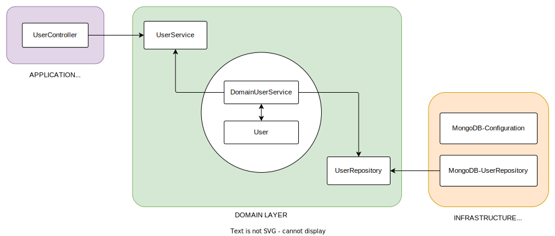
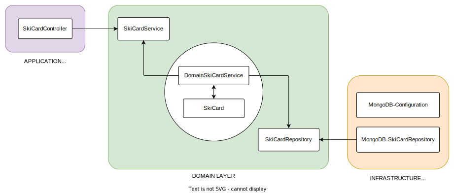

# SkiResort ticket shop

Projekt je sestavljen iz spletne aplikacije, ki služi kot vmesnik za nakup smučarskih kart. Za delovanje spletne aplikacije imamo tudi zaledje sestavljeno iz [UserService](#1-načrt-userservice), [SkiCardService](#2-načrt-orderservice) in [OrderService](#3-načrt-skicardservice).

## 1. Načrt UserService

<table style="margin: 0 auto; width: 100%;">
  <thead>
    <tr style="color: #fff;">
        <th style="text-align:center; font-size: 20px" colspan="2">Zahteve</th>
    </tr>
    <tr style="color: #fff;">
      <th>Funkcionalne</th>
      <th>Ne-funkcionalne</th>
    </tr>
  </thead>
  <tbody>
    <tr>
      <td style="background-color: #eee; color: #000">Nov kupec lahko ustvari račun</td>
      <td style="background-color: #eee; color: #000">Vsaka zahteva more biti obdelana v majn kot 10 sekundah</td>
    </tr>
    <tr>
      <td style="background-color: #333; color: #fff">Avtentikacija uporabnika ob vpisu v sistem</td>
      <td style="background-color: #333; color: #fff">Sistem mora biti sposoben odelati več 100 zahtev v danem trenutku</td>
    </tr>
    <tr>
      <td style="background-color: #eee; color: #000">Uporabnik lahko spremeni svoje podatke</td>
      <td style="background-color: #eee; color: #000">Ne delovanje sistema mora biti jasno obrazloženo</td>
    </tr>
  </tbody>
</table>

 

## 2. Načrt OrderService

<table style="margin: 0 auto; width: 100%;">
  <thead>
    <tr style="color: #fff;">
        <th style="text-align:center; font-size: 20px" colspan="2">Zahteve</th>
    </tr>
    <tr style="color: #fff;">
      <th>Funkcionalne</th>
      <th>Ne-funkcionalne</th>
    </tr>
  </thead>
  <tbody>
    <tr>
      <td style="background-color: #eee; color: #000">Uporabnik lahko opravi nakup smučarskih kart</td>
      <td style="background-color: #eee; color: #000">Vsaka zahteva more biti obdelana v majn kot 10 sekundah</td>
    </tr>
    <tr>
      <td style="background-color: #333; color: #fff">Uporabnik lahko aktivira smučarsko karto</td>
      <td style="background-color: #333; color: #fff">Sistem mora biti sposoben odelati več 100 zahtev v danem trenutku</td>
    </tr>
    <tr>
      <td style="background-color: #eee; color: #000">Ob nakupu se uporabniku pošlje potrditveni mail z računom</td>
      <td style="background-color: #eee; color: #000">E-mail mora biti poslan v majn kot 15 minutah</td>
    </tr>
  </tbody>
</table>

 

## 3. Načrt SkiCardService

<table style="margin: 0 auto; width: 100%;">
  <thead>
    <tr style="color: #fff;">
        <th style="text-align:center; font-size: 20px" colspan="2">Zahteve</th>
    </tr>
    <tr style="color: #fff;">
      <th>Funkcionalne</th>
      <th>Ne-funkcionalne</th>
    </tr>
  </thead>
  <tbody>
    <tr>
      <td style="background-color: #eee; color: #000">Uporabnik lahko sam  aktivira svoje kupljene karte pred uporabo</td>
      <td style="background-color: #eee; color: #000">Vsaka zahteva more biti obdelana v majn kot 10 sekundah</td>
    </tr>
    <tr>
      <td style="background-color: #333; color: #fff">Sistem avtomatsko deaktivira karte po izteku</td>
      <td style="background-color: #333; color: #fff">Sistem mora biti sposoben odelati več 100 zahtev v danem trenutku</td>
    </tr>
    <tr>
      <td style="background-color: #eee; color: #000">Administratorji lahko ustvarijo nove karte</td>
      <td style="background-color: #eee; color: #000">Ne delovanje sistema mora biti jasno obrazloženo</td>
    </tr>
  </tbody>
</table>